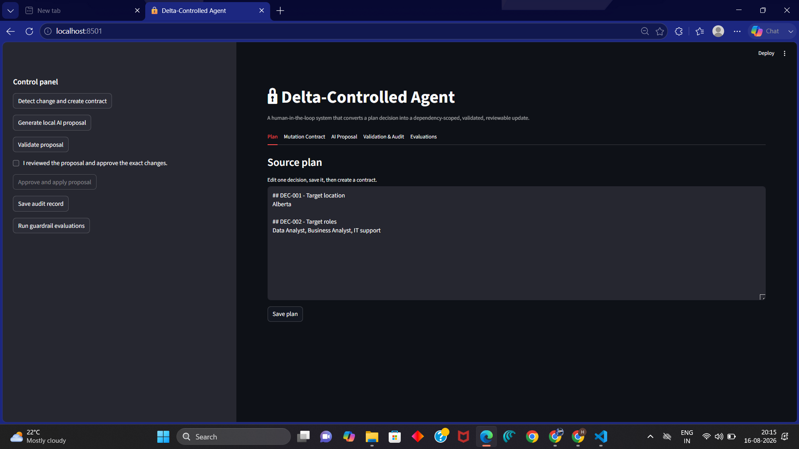
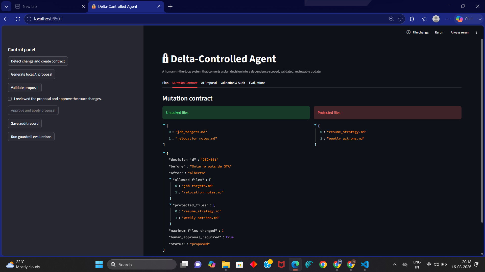
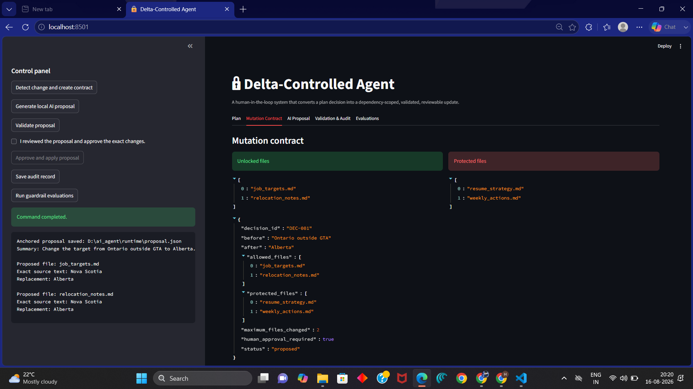
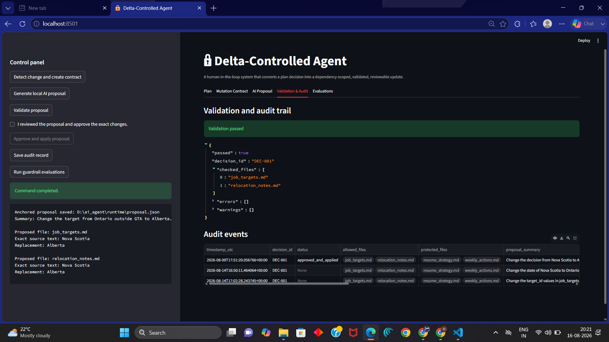
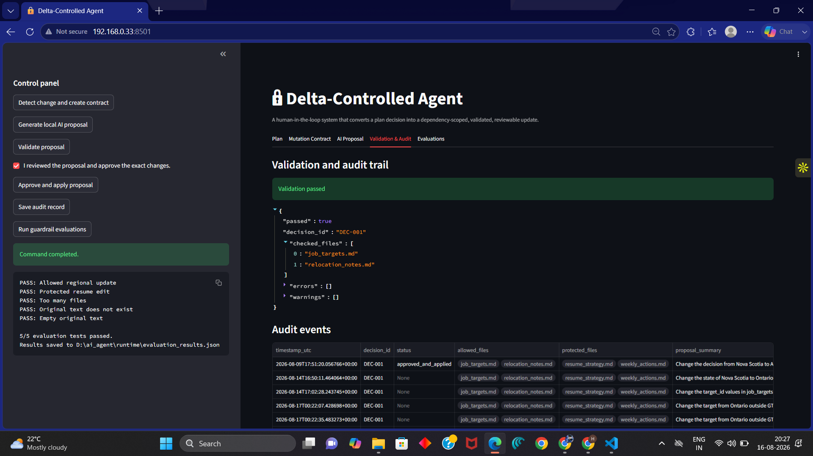

#  Delta-Controlled Agent

A human-in-the-loop AI system that converts one Markdown plan change into a small, dependency-scoped, validated, and reviewable update.

## The problem

AI agents can make broad, unpredictable changes when they are given a large set of files and a vague instruction.

For example, if a user changes a plan from **“Nova Scotia”** to **“Ontario”**, a normal agent may update unrelated files such as resume strategy or weekly actions.

This project explores a different model:

> An agent should only be allowed to update the specific files affected by a decision—and a human should approve the exact proposed changes before anything is written.

## Core idea

Think of the agent as a painter in a house.

* The workspace files are the rooms.
* The local LLM is the painter.
* The mutation contract is the job card.
* Protected files are locked rooms.
* The validator is the inspector.
* Human approval is the homeowner’s final decision.

If the user changes one decision, the system opens only the related rooms. The agent cannot edit the locked rooms.

## How it works

```text
Edit plan.md
   ↓
Detect changed decision
   ↓
Read dependency rules
   ↓
Create mutation contract
   ↓
Local LLM generates a structured proposal
   ↓
Anchor proposal to exact source text
   ↓
Validate scope and safety rules
   ↓
Human reviews and approves
   ↓
Apply minimal changes + save audit record
```

## Guardrails

The system prevents an AI proposal from being applied when it:

* modifies a protected file
* changes a file outside the allowed dependency scope
* exceeds the maximum allowed number of files
* replaces text that does not exist exactly once
* submits an empty replacement
* proposes a no-op change
* tries to apply changes without validation and human approval

## Technology

* Python
* Streamlit
* Ollama
* Qwen 2.5 local model
* Pydantic
* Git for change detection and diffs

## Project structure

```text
delta-controlled-agent/
├── app.py                     # Streamlit dashboard
├── src/                       # Core agent workflow
│   ├── controlled_workflow.py
│   ├── proposal_agent.py
│   ├── validate_proposal.py
│   ├── apply_approved_proposal.py
│   ├── audit_logger.py
│   └── run_evaluations.py
├── config/
│   └── dependencies.json      # Decision-to-file dependency rules
├── workspace/                 # Sample Markdown working files
├── runtime/                   # Generated local files, excluded from Git
├── tests/
└── archive/learning_steps/    # Earlier learning iterations
```

## Run locally

### 1. Clone the repository

```bash
git clone https://github.com/Hasnainali19/delta-controlled-agent.git
cd delta-controlled-agent
```

### 2. Create and activate a virtual environment

```powershell
python -m venv .venv
.\.venv\Scripts\Activate.ps1
```

### 3. Install dependencies

```powershell
pip install -r requirements.txt
```

### 4. Install and run the local model

```powershell
ollama pull qwen2.5:1.5b
```

### 5. Start the dashboard

```powershell
streamlit run app.py
```

Open the local URL shown in the terminal, usually `http://localhost:8501`.

## Demo workflow

1. Edit one decision in `workspace/plan.md`.
2. Click **Detect change and create contract**.
3. Review the files that are allowed and protected.
4. Click **Generate local AI proposal**.
5. Click **Validate proposal**.
6. Inspect the proposed exact replacements.
7. Check the approval box only if the proposal is correct.
8. Click **Approve and apply proposal**.
9. Review the final delta with:

```powershell
git --no-pager diff
```

10. Save an audit record and run guardrail evaluations.

## Why this project matters

This project is not trying to make agents completely autonomous.

It focuses on making AI agents safer and easier to collaborate with at a fine-grained level:

* small changes create small deltas
* dependencies determine scope
* the model proposes instead of directly editing
* deterministic code validates the model output
* humans retain the final decision
* Git and audit logs make the process traceable

## Current limitations

* Dependency rules are manually configured in `config/dependencies.json`.
* Scope is currently controlled at a file and exact-text level.
* Protected-file changes need explicit human scope expansion.
* The local model may still generate weak proposals; the validator is designed to block unsafe ones.

## Future improvements

* Add a formal “scope expansion request” when a protected file may need updating.
* Support section-level and semantic dependency graphs.
* Add automated test coverage with `pytest`.
* Add proposal diffs directly in the dashboard.
* Compare model quality across local and hosted models.

## Demo screenshots

### 1. A small plan decision changes



### 2. The mutation contract unlocks only relevant files



### 3. The local LLM proposes exact replacements



### 4. Validation checks the proposal before any update is applied



### 5. Guardrail evaluations test safe and unsafe cases



## Author

**Hasnainali Saiyed**
Built as a portfolio project exploring controllable, human-in-the-loop AI agents.


